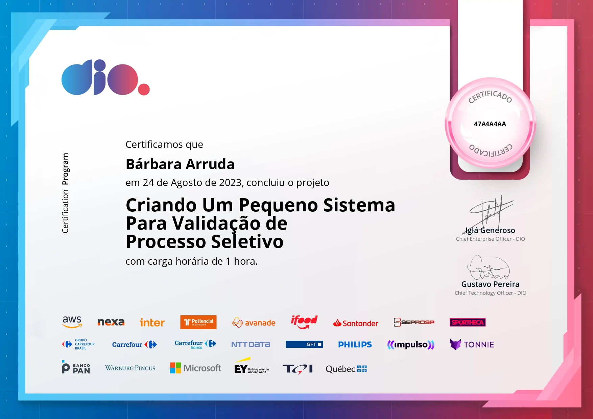

# CONTROLE DE CANDIDATOS
Projeto prático do Programa de Desenvolvimento Fullstack Santander - Java e Angular 2023 | Practical project of the Santander Fullstack Development Program - Java and Angular 2023 | 桑坦德銀行全棧開發計劃實踐項目 - Java 和 Angular 2023
## 📋 Materiais e métodos utilizados:
1. Java 19 / OpenJDK 19;
2. Sistema Operacional Linux Mint Mate 21 "Victoria";
3. Visual Studio Code.
### 🔧 Instalação:
Instalar os materiais e métodos utilizados. Após, fazer um clone do repositório e testar localmente na IDE.
#### 🎖️ Certificado:

  

## Getting Started

Welcome to the VS Code Java world. Here is a guideline to help you get started to write Java code in Visual Studio Code.

## Folder Structure

The workspace contains two folders by default, where:

- `src`: the folder to maintain sources
- `lib`: the folder to maintain dependencies

Meanwhile, the compiled output files will be generated in the `bin` folder by default.

> If you want to customize the folder structure, open `.vscode/settings.json` and update the related settings there.

## Dependency Management

The `JAVA PROJECTS` view allows you to manage your dependencies. More details can be found [here](https://github.com/microsoft/vscode-java-dependency#manage-dependencies).
